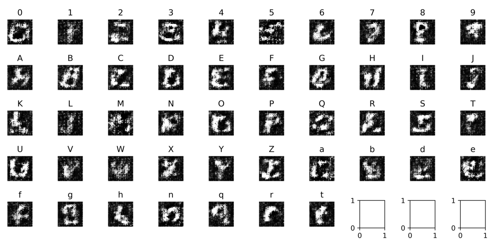
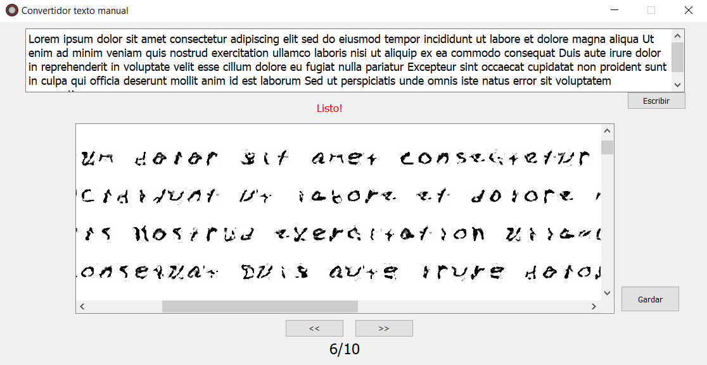
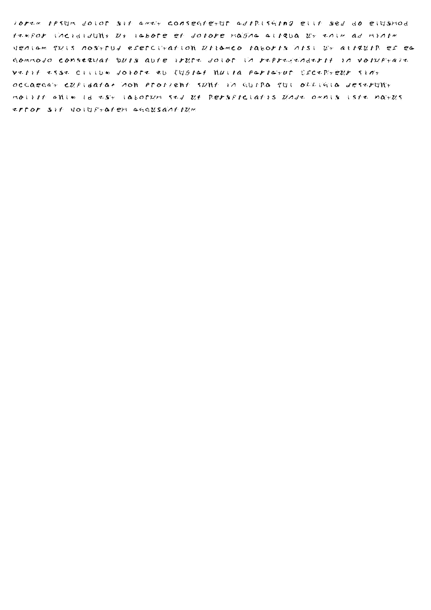

#Handwritten Text Generator using Generative Adversarial Networks.

## Description

This project involves the development of an interface that enables automated generation of handwritten texts using Generative Adversarial Networks (GAN) algorithm. The power of AI is harnessed to learn and reproduce the style of handwritten text. Additionally, the online collaboration platform (Colab) is utilized to expedite the model training process. Explore with different texts and witness how the AI generates realistic and authentic handwritten text results.
## Getting Started

### Dependencies

* Operating System: Windows 10 Home 64-bit - version 21H2.
* Programming Language: Python 3.11.
* IDE: PyCharm Professional 2021.3.3
* Libraries:
  * NumPy v1.24.3
  * TensorFlow v2.13
  * TensorFlow-datasets v4.9.2
  * Matplotlib v3.7.2
  * PyQt5 v5.15.2
  * Unidecode 1.3.6
  * Pillow 10.0.0

## Author
Roi Rodríguez

## Data

This project uses the tensorflow dataset emnist/balanced.

[DOCUMENTATION](https://www.tensorflow.org/datasets/catalog/emnist#emnistbalanced)
## Results
### Training evolution

## Interface

